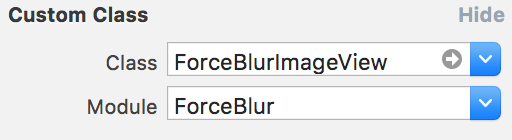

# ForceBlur

## Features

- [x] Display private content
- [x] Easy to use
- [x] Use with storyboards, XIBs, code
- [x] Compatible with [JSQMessagesViewController](https://github.com/jessesquires/JSQMessagesViewController)

## ForceBlurImageView

- iOS 9+
- Xcode 8
- Swift 3

## Usage

### In interface builder (storyboard, xib)

To use the component in interface builder you need to set custom class for UIImageView:

